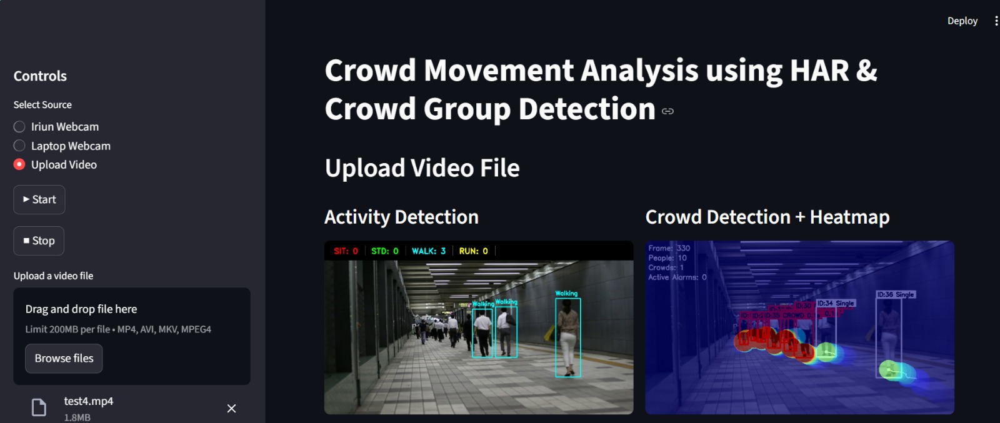
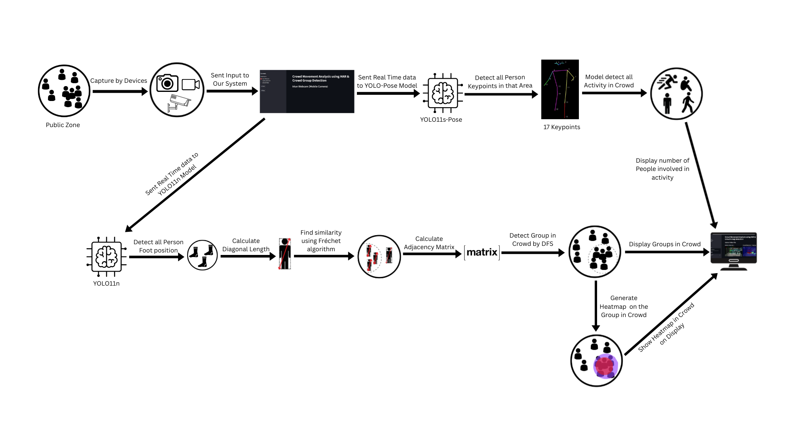
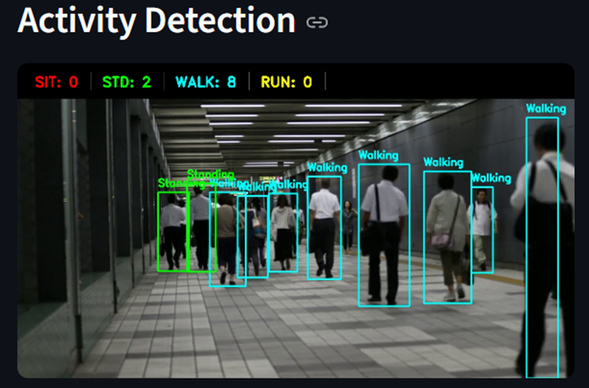
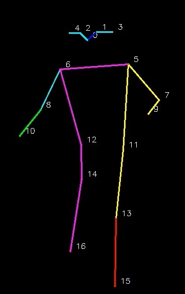
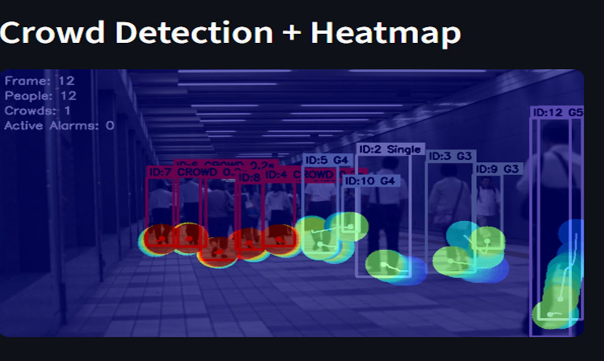
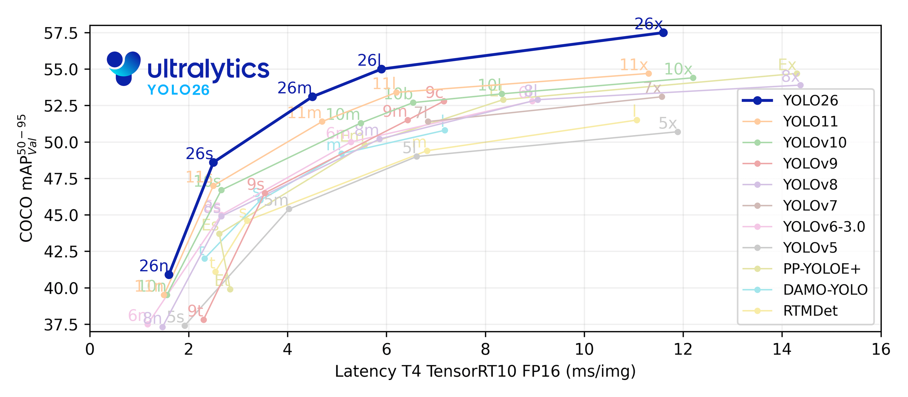

# Crowd Activity Detection and Analysis

## Overview

Crowd Activity Detection and Analysis is a real-time computer vision system designed for intelligent crowd monitoring and surveillance. The system combines Human Activity Recognition (HAR), Crowd Group Detection, Multi-Object Tracking, and Density Heatmap Generation to analyze crowd behavior in live video streams and recorded videos.

The project uses YOLO11-based object detection and pose estimation models to identify individuals, classify activities, track movement trajectories, detect crowd formations, and generate real-time visual analytics through an interactive Streamlit dashboard.

---

## Dashboard Interface

The Streamlit dashboard provides a user-friendly interface for real-time monitoring and analysis.



---

## Key Features

### Human Activity Recognition (HAR)

The system identifies and classifies human activities into:

* Sitting
* Standing
* Walking
* Running

### Crowd Group Detection

The system detects crowd formations by analyzing:

* Spatial proximity
* Movement trajectories
* Group interactions
* Crowd persistence over time

### Multi-Object Tracking

* DeepSORT tracking
* Persistent person IDs
* Trajectory history
* Occlusion handling

### Density Heatmap Generation

* Real-time crowd density visualization
* High-density zone detection
* Crowd movement analysis

### Multiple Input Sources

* Laptop Webcam
* Iriun Mobile Webcam
* Uploaded Video Files

### Interactive Dashboard

* Live monitoring
* Dual-model visualization
* Real-time analytics
* User-friendly interface

---

## System Architecture



---

## Human Activity Recognition

The activity recognition module uses YOLO11s-Pose to extract 17 skeletal keypoints from detected individuals.

Activities are classified using:

* Knee-angle analysis
* Motion speed estimation
* Pose geometry
* Temporal tracking history



---

## Pose Estimation

The system utilizes YOLO11s-Pose to detect 17 body keypoints for each individual.



---

## Crowd Detection and Density Analysis

Crowd formations are detected using:

* Distance-based interaction analysis
* Fréchet trajectory similarity
* Graph-based clustering
* Depth First Search (DFS)

Dynamic density heatmaps highlight areas with high crowd concentration.



---

## Research Contributions

* Real-time Human Activity Recognition
* Height-normalized speed estimation
* Knee-angle based posture recognition
* Fréchet-distance trajectory similarity analysis
* Graph-based crowd clustering
* Real-time crowd alarm generation
* Dynamic density heatmap visualization

---

## Why YOLO11?

In this work, we choose YOLO11 as the object detection backbone because it offers a strong balance between detection accuracy and inference speed compared to recent YOLO-based models. Benchmark results on the COCO dataset show that YOLO11 consistently achieves higher mAP@50–95 while maintaining equal or lower inference latency when evaluated using TensorRT FP16 on an NVIDIA T4 GPU.

YOLO11 also performs reliably across different model scales, ranging from nano to extra-large variants. Compared to YOLOv8, YOLOv9, YOLOv10, and YOLOX, it provides more stable accuracy improvements without introducing additional computational overhead. This makes it well suited for real-time crowd monitoring, where both speed and accuracy are critical.

The reduced inference latency of YOLO11 allows efficient deployment in live CCTV and video surveillance systems, while still maintaining robust detection performance in dense and partially occluded crowd scenes. For these reasons, YOLO11 is adopted in this study to support real-time operation, scalability, and dependable object detection for intelligent crowd analysis.

### YOLO Model Comparison



---

## Performance Metrics

| Metric    | Value  |
| --------- | ------ |
| Precision | 0.9112 |
| Recall    | 0.8571 |
| mAP@50    | 0.8722 |
| mAP@50-95 | 0.4809 |
| FPS       | 15     |

---

## Installation

### Clone Repository

```bash
git clone https://github.com/wSubham/Crowd-Activity-Detection-and-Analysis.git

cd Crowd-Activity-Detection-and-Analysis
```

### Create Virtual Environment

```bash
python -m venv venv
```

Windows:

```bash
venv\Scripts\activate
```

Linux / macOS:

```bash
source venv/bin/activate
```

### Install Dependencies

```bash
pip install -r requirements.txt
```

### Run Application

```bash
streamlit run app/ui.py
```

Open in browser:

```text
http://localhost:8501
```

---

## Project Structure

```text
Crowd-Activity-Detection-and-Analysis
│
├── app
│   ├── camera.py
│   ├── model.py
│   └── ui.py
│
├── models
│   ├── yolo11n.pt
│   └── yolo11s-pose.pt
│
├── assets
│   ├── architecture.png
│   ├── dashboard.png
│   ├── activity_detection.png
│   ├── crowd_heatmap.png
│   ├── pose_estimation.png
│   └── yolo11_comparison.png
│
├── requirements.txt
├── README.md
├── LICENSE
└── .gitignore
```

---

## Supported Inputs

* CCTV Video Streams
* Laptop Webcam
* Iriun Mobile Camera
* Uploaded Video Files

---

## Future Scope

* Violence Detection
* Fall Detection
* Weapon Detection
* Multi-Camera Tracking
* Person Re-Identification (ReID)
* Mobile Alert System
* Cloud Deployment
* Database Logging and Analytics

---

## Project Team

* Subham Das
* Suprakash Maji
* Sayan Paul
* Rik Mondal
* Sourav Nayek

### Academic Supervisor

**Dr. Moumita Roy**

---

## Acknowledgements

* Ultralytics YOLO11
* DeepSORT Tracking
* OpenCV
* Streamlit
* NumPy

---

## License

This project is released under the MIT License.
